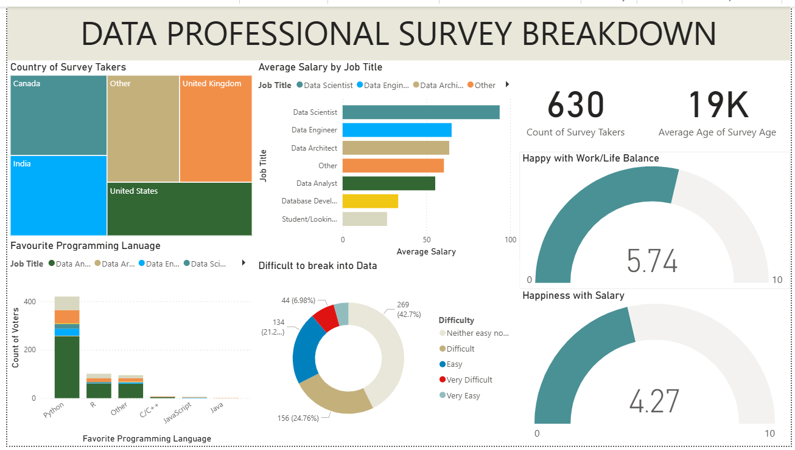
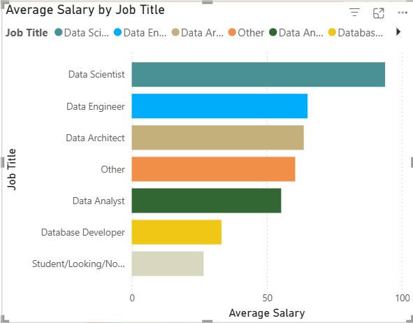
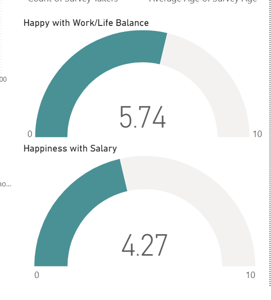

# 📊 Data Professional Survey Breakdown — Power BI

## Project Overview
An interactive Power BI dashboard built from a real-world survey 
of 630 data professionals collected in 2022. The dashboard analyzes 
salary trends, programming language preferences, job satisfaction, 
and difficulty breaking into the data field.

## Dataset
- Source: Real survey data from data professionals worldwide
- Format: Excel (.xlsx)
- Records: 630 survey responses

## Tools Used
- Microsoft Power BI
- Power Query Editor

## 🧹 Data Cleaning (Power Query)
- Removed irrelevant columns (Browser, OS, City, Country, Referrer)
- Split and cleaned the Job Title column using custom delimiter
- Split and cleaned Favourite Programming Language column
- Cleaned Current Yearly Salary column (range format e.g. 106k–125k):
  - Split by digit to non-digit
  - Replaced k, -, + symbols
  - Created Average Salary custom column: (A+B)/2
- Cleaned Industry and Country columns using delimiter splitting
- Converted text columns to numeric (Whole Number)

## 📊 Dashboard Visuals
| Visual | Description |
|--------|-------------|
| Tree Map | Country distribution of survey takers |
| Stacked Bar Chart | Average salary by job title |
| Stacked Bar Chart | Favourite programming language by job title |
| Donut Chart | Difficulty breaking into data field |
| Gauge Chart | Happiness with work/life balance (avg: 5.74/10) |
| Gauge Chart | Happiness with salary (avg: 4.27/10) |
| Cards | Total survey takers (630) and average age (19K) |

## 📸 Dashboard Preview




## 💡 Key Insights
- Data Scientists earn the highest average salary among all roles
- Python is the most preferred programming language across job titles
- ~43% of respondents found breaking into data neither easy nor difficult
- Work/life balance satisfaction (5.74) is higher than salary 
  satisfaction (4.27) among data professionals
- United States has the highest representation among survey takers
```

